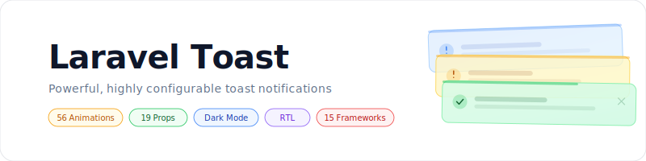

<p align="center">
    <picture>
        <source media="(prefers-color-scheme: dark)" srcset="art/banner-dark.svg">
        <source media="(prefers-color-scheme: light)" srcset="art/banner-light.svg">
        
    </picture>
</p>

<p align="center">
Powerful, highly configurable toast notifications for Laravel with 56 animations,<br>19 per-toast props, RTL support, dark mode, and full CSS/frontend framework parity.
</p>

<p align="center">
  <a href="https://packagist.org/packages/jeremykenedy/laravel-toast"></a>
  <a href="https://github.com/jeremykenedy/laravel-toast/actions"></a>
  <a href="https://github.styleci.io/repos/1195049143?branch=main"></a>
  <a href="https://opensource.org/licenses/MIT"></a>
</p>

## Table of Contents

- [Framework Support Matrix](#framework-support-matrix)
- [Installation](#installation)
- [Quick Start](#quick-start)
- [Configuration](#configuration)
- [Props Reference](#props-reference)
- [Animations](#animations)
- [Dark Mode](#dark-mode)
- [Customizing Colors](#customizing-colors)
- [Usage](#usage)
- [Artisan Commands](#artisan-commands)
- [Testing](#testing)
- [License](#license)

## Framework Support Matrix

Every CSS and frontend combination is fully supported with identical features:

|                 | Blade + Alpine.js  |     Livewire 3     |       Vue 3        |      React 18      |      Svelte 4      |
| --------------- | :----------------: | :----------------: | :----------------: | :----------------: | :----------------: |
| **Tailwind v4** | :white_check_mark: | :white_check_mark: | :white_check_mark: | :white_check_mark: | :white_check_mark: |
| **Bootstrap 5** | :white_check_mark: | :white_check_mark: | :white_check_mark: | :white_check_mark: | :white_check_mark: |
| **Bootstrap 4** | :white_check_mark: | :white_check_mark: | :white_check_mark: | :white_check_mark: | :white_check_mark: |

**15 combinations. Zero feature gaps.**

## Requirements

- PHP 8.2+
- Laravel 12 or 13
- One CSS framework: Tailwind v4, Bootstrap 5, or Bootstrap 4
- One frontend: Blade + Alpine.js, Livewire 3, Vue 3, React 18, or Svelte 4

## Installation

```bash
composer require jeremykenedy/laravel-toast
php artisan toast:install --css=tailwind --frontend=blade
```

Add to your layout before `</body>`:

```blade
@include('toast::toasts')
```

Or with the directive: `@toasts`

For Livewire: `<livewire:toast-container />`

## Quick Start

```php
// In any controller, service, or middleware
toast('Settings saved.');
toast('Upload failed.', 'error', 'Error');
toast('Heads up!', 'warning', null, 3000);

// Fluent chaining
toast()->success('Step 1 done.')->info('Starting step 2...');

// Facade
Toast::success('Created!');
Toast::error('Denied.', 'Access Error');
```

Existing flash messages work automatically:

```php
return back()->with('success', 'Profile updated.');
// Displays as a success toast with no code changes
```

## Configuration

```bash
php artisan vendor:publish --tag=toast-config
```

Every config option is also an ENV variable and a per-toast prop override:

```env
TOAST_POSITION=top-right
TOAST_DIR=ltr
TOAST_DURATION=5000
TOAST_AUTO_DISMISS=true
TOAST_PAUSE_ON_HOVER=true
TOAST_STACK=true
TOAST_SHOW_ICONS=true
TOAST_SHOW_BORDER=true
TOAST_SHOW_CLOSE=true
TOAST_SHOW_PROGRESS=true
TOAST_PROGRESS_DIRECTION=rtl
TOAST_PROGRESS_POSITION=top
TOAST_OPACITY=1
TOAST_ENTER_ANIMATION=none
TOAST_ENTER_DURATION=0.5
TOAST_EXIT_ANIMATION=none
TOAST_EXIT_DURATION=0.5
TOAST_MAX_VISIBLE=5
```

## Props Reference

All props work as global config defaults AND per-toast overrides.

| Prop                 | Default     | Options                                                                          |
| -------------------- | ----------- | -------------------------------------------------------------------------------- |
| `position`           | `top-right` | `top-left` `top-right` `top-center` `bottom-left` `bottom-right` `bottom-center` |
| `dir`                | `ltr`       | `ltr` `rtl`                                                                      |
| `duration`           | `5000`      | Milliseconds (0 = no auto-dismiss)                                               |
| `auto_dismiss`       | `true`      | `true` `false`                                                                   |
| `pause_on_hover`     | `true`      | `true` `false`                                                                   |
| `stack`              | `true`      | `true` (accumulate) `false` (replace)                                            |
| `max_visible`        | `5`         | Any integer                                                                      |
| `show_icon`          | `true`      | `true` `false`                                                                   |
| `custom_icon`        | `null`      | Raw SVG HTML string                                                              |
| `show_border`        | `true`      | `true` `false`                                                                   |
| `show_close`         | `true`      | `true` `false`                                                                   |
| `show_progress`      | `true`      | `true` `false`                                                                   |
| `progress_direction` | `rtl`       | `rtl` `ltr`                                                                      |
| `progress_position`  | `top`       | `top` `bottom`                                                                   |
| `opacity`            | `1`         | `0` to `1`                                                                       |
| `enter_animation`    | `none`      | See [Animations](#animations)                                                    |
| `enter_duration`     | `0.5`       | Seconds                                                                          |
| `exit_animation`     | `none`      | See [Animations](#animations)                                                    |
| `exit_duration`      | `0.5`       | Seconds                                                                          |

### Per-Toast Override

```php
toast()->success('Saved!', 'Done', 3000, [
    'position'           => 'bottom-right',
    'dir'                => 'rtl',
    'show_border'        => false,
    'show_close'         => false,
    'enter_animation'    => 'slide-right',
    'enter_duration'     => 0.3,
    'exit_animation'     => 'bounce-left',
    'exit_duration'      => 0.5,
    'progress_position'  => 'bottom',
    'opacity'            => 0.9,
]);
```

## Animations

56 animation styles available for both `enter_animation` and `exit_animation`.
Directionless names (e.g., `slide`, `bounce`) use a sensible default (typically center or right):

| Style                | Enter                                          | Exit                                  |
| -------------------- | ---------------------------------------------- | ------------------------------------- |
| `none`               | Instant appear                                 | Instant remove                        |
| **Fade**             |                                                |                                       |
| `fade`               | Fade in                                        | Fade out                              |
| `fade-center`        | Fade in (alias)                                | Fade out (alias)                      |
| **Slide**            |                                                |                                       |
| `slide`              | Slide in from right (default)                  | Slide out to right (default)          |
| `slide-left`         | Slide in from left                             | Slide out to left                     |
| `slide-right`        | Slide in from right                            | Slide out to right                    |
| `slide-top`          | Slide in from top                              | Slide out to top                      |
| `slide-bottom`       | Slide in from bottom                           | Slide out to bottom                   |
| **Bounce**           |                                                |                                       |
| `bounce`             | Scale up, overshoot, settle (default)          | Scale up, overshoot, shrink (default) |
| `bounce-left`        | Overshoot from left then settle                | Bounce right then exit left           |
| `bounce-right`       | Overshoot from right then settle               | Bounce left then exit right           |
| `bounce-top`         | Overshoot from top then settle                 | Bounce down then exit top             |
| `bounce-bottom`      | Overshoot from bottom then settle              | Bounce up then exit bottom            |
| `bounce-center`      | Scale up, overshoot, settle                    | Scale up, overshoot, shrink           |
| **Shrink**           |                                                |                                       |
| `shrink`             | Scale up from center (default)                 | Scale down to center (default)        |
| `shrink-left`        | Expand from right edge                         | Collapse toward right edge            |
| `shrink-right`       | Expand from left edge                          | Collapse toward left edge             |
| `shrink-top`         | Expand from bottom edge                        | Collapse toward bottom edge           |
| `shrink-bottom`      | Expand from top edge                           | Collapse toward top edge              |
| `shrink-center`      | Scale up from center                           | Scale down to center                  |
| **Flip** (3D)        |                                                |                                       |
| `flip`               | Flip in 180 Y-axis (default)                   | Flip out 180 Y-axis (default)         |
| `flip-left`          | Flip in from right (Y-axis)                    | Flip out to left (Y-axis)             |
| `flip-right`         | Flip in from left (Y-axis)                     | Flip out to right (Y-axis)            |
| `flip-top`           | Flip in from bottom (X-axis)                   | Flip out to top (X-axis)              |
| `flip-bottom`        | Flip in from top (X-axis)                      | Flip out to bottom (X-axis)           |
| `flip-center`        | Flip in 180 (Y-axis)                           | Flip out 180 (Y-axis)                 |
| **Spin**             |                                                |                                       |
| `spin`               | Spin in + scale up (default)                   | Spin out + scale down (default)       |
| `spin-left`          | Spin in from left                              | Spin out to left                      |
| `spin-right`         | Spin in from right                             | Spin out to right                     |
| `spin-top`           | Spin in from top                               | Spin out to top                       |
| `spin-bottom`        | Spin in from bottom                            | Spin out to bottom                    |
| `spin-center`        | Spin in + scale up                             | Spin out + scale down                 |
| **Grow**             |                                                |                                       |
| `grow`               | Scale up from center (default)                 | Scale down to center (default)        |
| `grow-left`          | Scale up from right edge                       | Scale down toward right edge          |
| `grow-right`         | Scale up from left edge                        | Scale down toward left edge           |
| `grow-top`           | Scale up from bottom edge                      | Scale down toward bottom edge         |
| `grow-bottom`        | Scale up from top edge                         | Scale down toward top edge            |
| `grow-center`        | Scale up from center                           | Scale down to center                  |
| **Slam** (overshoot) |                                                |                                       |
| `slam`               | Scale from 0, overshoot 120%, settle (default) | Overshoot 115%, scale to 0 (default)  |
| `slam-left`          | Fly in from left, overshoot 115%, settle       | Overshoot 115%, fly out left          |
| `slam-right`         | Fly in from right, overshoot 115%, settle      | Overshoot 115%, fly out right         |
| `slam-top`           | Fly in from top, overshoot 115%, settle        | Overshoot 115%, fly out top           |
| `slam-bottom`        | Fly in from bottom, overshoot 115%, settle     | Overshoot 115%, fly out bottom        |
| `slam-center`        | Scale from 0, overshoot 120%, settle           | Overshoot 115%, scale to 0            |
| **Wobble**           |                                                |                                       |
| `wobble`             | Wobble side-to-side then appear (default)      | Wobble side-to-side then disappear    |
| `wobble-left`        | Wobble in from left                            | Wobble then exit left                 |
| `wobble-right`       | Wobble in from right                           | Wobble then exit right                |
| `wobble-top`         | Wobble in from top                             | Wobble then exit top                  |
| `wobble-bottom`      | Wobble in from bottom                          | Wobble then exit bottom               |
| `wobble-center`      | Wobble + scale up from center                  | Wobble + scale down to center         |

Enter and exit animations have independent duration controls (`enter_duration`, `exit_duration`).

## Dark Mode

All three CSS frameworks support dark mode:

**Tailwind v4** uses `dark:` variant classes automatically. No extra setup needed.

**Bootstrap 5** uses `text-bg-*` classes that respect `[data-bs-theme="dark"]`. Add to your `<html>` tag:

```html
<html data-bs-theme="dark"></html>
```

**Bootstrap 4** uses inline styles for dark mode. The toast views detect `.dark` on the body class or `prefers-color-scheme: dark` media query.

## Customizing Colors

### Tailwind v4

Override toast colors via your `app.css` with theme accent variables or direct utility overrides:

```css
/* Light mode */
.toast-success {
    @apply bg-emerald-50 text-emerald-900 border-emerald-300;
}
.toast-error {
    @apply bg-rose-50 text-rose-900 border-rose-300;
}

/* Dark mode */
.dark .toast-success {
    @apply bg-emerald-950 text-emerald-100 border-emerald-700;
}
.dark .toast-error {
    @apply bg-rose-950 text-rose-100 border-rose-700;
}
```

Or publish and edit the views directly:

```bash
php artisan vendor:publish --tag=toast-views
# Edit resources/views/vendor/toast/tailwind/blade/toasts.blade.php
```

### Bootstrap 5

Override Bootstrap contextual colors in your stylesheet:

```css
/* Light mode */
.toast.text-bg-success {
    background-color: #d1fae5 !important;
    color: #065f46 !important;
}
.toast.text-bg-danger {
    background-color: #fee2e2 !important;
    color: #991b1b !important;
}

/* Dark mode */
[data-bs-theme="dark"] .toast.text-bg-success {
    background-color: #064e3b !important;
    color: #d1fae5 !important;
}
[data-bs-theme="dark"] .toast.text-bg-danger {
    background-color: #7f1d1d !important;
    color: #fee2e2 !important;
}
```

### Bootstrap 4

Override Bootstrap 4 alert colors:

```css
/* Light mode */
.alert-success {
    background-color: #d1fae5;
    border-color: #6ee7b7;
    color: #065f46;
}
.alert-danger {
    background-color: #fee2e2;
    border-color: #fca5a5;
    color: #991b1b;
}

/* Dark mode */
.dark .alert-success,
@media (prefers-color-scheme: dark) {
    .alert-success {
        background-color: #064e3b;
        border-color: #047857;
        color: #d1fae5;
    }
}
.dark .alert-danger,
@media (prefers-color-scheme: dark) {
    .alert-danger {
        background-color: #7f1d1d;
        border-color: #b91c1c;
        color: #fee2e2;
    }
}
```

## Usage

### Facade

```php
use Jeremykenedy\LaravelToast\Facades\Toast;

Toast::success('Saved.');
Toast::error('Failed.', 'Error');
Toast::warning('Low storage.');
Toast::info('Update available.');
Toast::clear();
```

### HasToasts Trait

```php
use Jeremykenedy\LaravelToast\Traits\HasToasts;

class UserController extends Controller
{
    use HasToasts;

    public function update(Request $request, User $user)
    {
        $user->update($request->validated());
        $this->toastSuccess('User updated.');
        return back();
    }
}
```

### Livewire Events

```php
// From any Livewire component
$this->dispatch('toast', message: 'Saved!', type: 'success');
$this->dispatch('toast-success', message: 'Created!');
$this->dispatch('toast-error', message: 'Failed!');

// With per-toast options
$this->dispatch('toast', message: 'RTL toast', type: 'info', options: [
    'dir' => 'rtl',
    'exit_animation' => 'slide-left',
]);
```

### Vue / React / Svelte

Pass toasts via Inertia props or `window.__toasts`:

```php
// Controller
return Inertia::render('Dashboard', [
    'toasts' => app(ToastManager::class)->get(),
]);
```

```html
<!-- Or in Blade layout -->
<script>
    window.__toasts = @json(app(ToastManager::class)->get());
</script>
```

## Artisan Commands

```bash
# Install (interactive)
php artisan toast:install

# Install (explicit)
php artisan toast:install --css=tailwind --frontend=blade

# Switch frameworks
php artisan toast:switch --css=bootstrap5
php artisan toast:switch --frontend=livewire
php artisan toast:switch --css=bootstrap4 --frontend=vue
```

## Publishing Assets

```bash
php artisan vendor:publish --tag=toast-config
php artisan vendor:publish --tag=toast-views
php artisan vendor:publish --tag=toast-lang
```

## Testing

```bash
php artisan test --filter=Toast
```

191 tests covering:

- All 19 props stored and rendered correctly
- All 3 CSS frameworks (Tailwind, BS5, BS4) x all positions x all props
- Livewire component with per-toast options
- Vue, React, Svelte component file verification (all props present)
- toast() helper, Facade, HasToasts trait, @toasts directive
- Flash message conversion
- Stacking and non-stacking modes
- Enter/exit animation keyframes
- All 15 install/switch framework combinations

## License

This package is open-sourced software licensed under the [MIT license](LICENSE).
