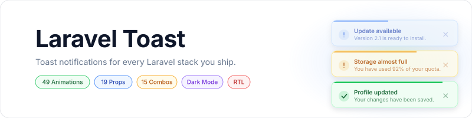
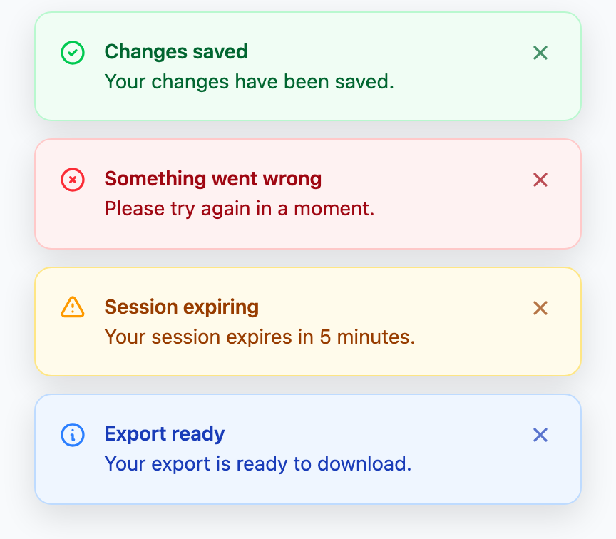
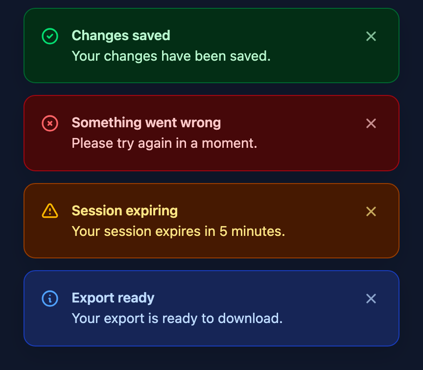
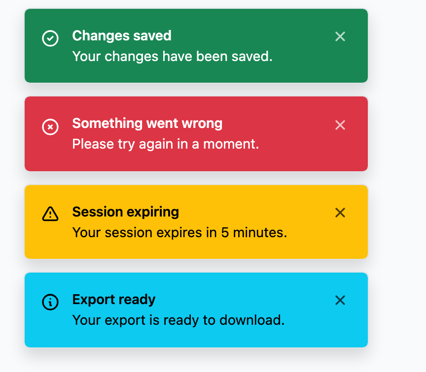
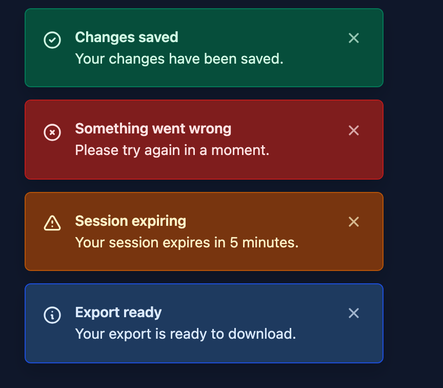
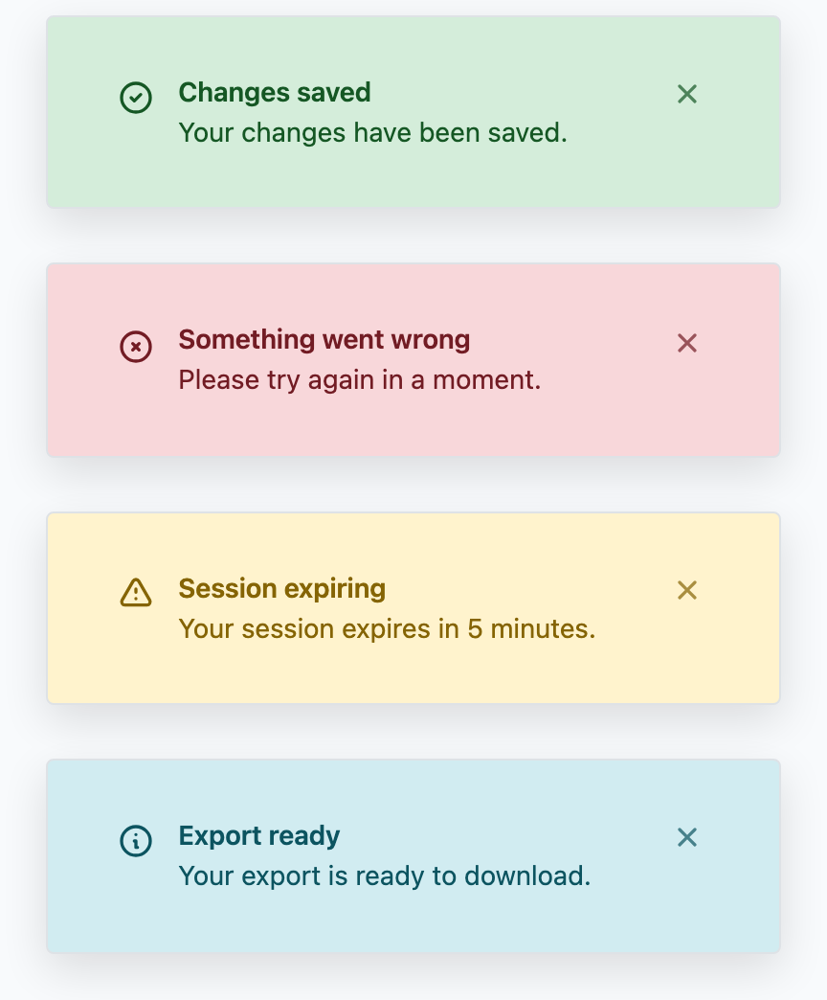
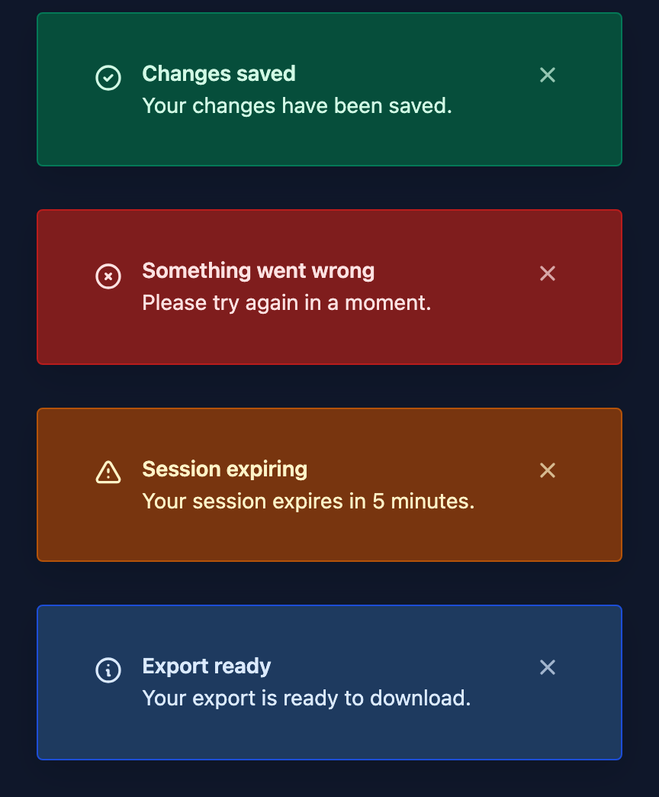

<p align="center">
    <picture>
        <source media="(prefers-color-scheme: dark)" srcset="art/banner-dark.svg">
        <source media="(prefers-color-scheme: light)" srcset="art/banner-light.svg">
        
    </picture>
</p>

<p align="center">
Toast notifications for Laravel with five frontends, three CSS frameworks, 49 animations, and private broadcasts.
</p>

<p align="center">
    <a href="https://packagist.org/packages/jeremykenedy/laravel-toast"></a>
    <a href="https://packagist.org/packages/jeremykenedy/laravel-toast"></a>
    <a href="https://github.com/jeremykenedy/laravel-toast/actions"></a>
    <a href="https://github.styleci.io/repos/1195049143?branch=main"></a>
    <a href="https://opensource.org/licenses/MIT"></a>
</p>

## Table of Contents

- [Framework Support](#framework-support)
- [Screenshots](#screenshots)
- [Requirements](#requirements)
- [Installation](#installation)
  - [Tailwind Setup](#tailwind-setup)
  - [Bootstrap Setup](#bootstrap-setup)
  - [Livewire Setup](#livewire-setup)
- [Quick Start](#quick-start)
  - [Blade](#blade)
  - [Livewire](#livewire)
  - [Sharing Toasts with Inertia](#sharing-toasts-with-inertia)
  - [Vue](#vue)
  - [React](#react)
  - [Svelte](#svelte)
- [Features](#features)
- [Configuration](#configuration)
  - [Per-Toast Options](#per-toast-options)
  - [JavaScript Container Props](#javascript-container-props)
- [Animations](#animations)
- [Styles and Dark Mode](#styles-and-dark-mode)
  - [Customizing Colors](#customizing-colors)
- [Usage](#usage)
  - [Facade and Trait](#facade-and-trait)
  - [Livewire Events](#livewire-events)
  - [Broadcasting](#broadcasting)
- [Changing Frameworks](#changing-frameworks)
  - [Update](#update)
  - [Switch](#switch)
- [Artisan Commands](#artisan-commands)
  - [Install Options](#install-options)
  - [Publishing Assets](#publishing-assets)
- [Testing](#testing)
- [File Tree](#file-tree)
- [Contributing](#contributing)
- [Changelog](#changelog)
- [License](#license)

## Framework Support

| CSS framework | Blade + Alpine.js | Livewire 3 / 4 | Vue 3 | React 18 | Svelte 4 |
|---------------|-------------------|----------------|-------|----------|----------|
| Tailwind v4 | Yes | Yes | Yes | Yes | Yes |
| Bootstrap 5.2+ | Yes | Yes | Yes | Yes | Yes |
| Bootstrap 4 | Yes | Yes | Yes | Yes | Yes |

Every pairing ships framework-appropriate colors and supports the same toast payload. JavaScript components select their classes from the payload's `css_framework`, or from an explicit `cssFramework` prop.

## Screenshots

The React container renders success, error, warning, and info notifications below using each supported CSS framework. Screenshots show the package's default colors in light and dark mode, with auto-dismiss disabled. Select an image to view it at full size.

| CSS framework | Light mode | Dark mode |
|---------------|------------|-----------|
| Tailwind v4 | [](art/screenshots/tailwind-light.png) | [](art/screenshots/tailwind-dark.png) |
| Bootstrap 5.2+ | [](art/screenshots/bootstrap5-light.png) | [](art/screenshots/bootstrap5-dark.png) |
| Bootstrap 4 | [](art/screenshots/bootstrap4-light.png) | [](art/screenshots/bootstrap4-dark.png) |

To refresh these screenshots from the actual components, install the development dependencies and Chromium, then run:

```bash
npm ci
npx playwright install chromium
npm run screenshots
```

## Requirements

- PHP 8.2+
- Laravel 10, 11, 12, or 13
- Tailwind v4, Bootstrap 5.2+, or Bootstrap 4 CSS
- Alpine.js for Tailwind Blade; Livewire 3 or 4 for the Livewire container; or Vue 3, React 18, or Svelte 4
- Laravel broadcasting, a queue worker, and Laravel Echo for optional real-time delivery

Bootstrap Blade toasts work without jQuery or the Bootstrap JavaScript bundle. CI selects Laravel 10 through 13 and both supported Livewire majors.

## Installation

```bash
composer require jeremykenedy/laravel-toast
php artisan toast:install
```

The installer publishes `config/toast.php` and records your framework choices in `.env`. If configuration already exists, it detects the installation and asks before reinstalling. Use `toast:update` or `toast:switch` to preserve customized configuration. `--force` permits reinstalling and replacing the configuration; published views are retained.

### Tailwind Setup

Register the package templates and components in `resources/css/app.css`:

```css
@import "tailwindcss";
@source "../../vendor/jeremykenedy/laravel-toast/resources";
```

Tailwind does not automatically scan ignored dependency directories. Keep your application's other imports and sources, and run `npm run build` after adding this source.

For Tailwind Blade, load Alpine.js once in your application. If it is not already installed:

```bash
npm install alpinejs
```

```js
import Alpine from 'alpinejs'

window.Alpine = Alpine
Alpine.start()
```

Livewire provides its own Alpine instance. Do not start a second instance in a Livewire application.

### Bootstrap Setup

Load the selected Bootstrap stylesheet in your application and choose the matching toast framework:

```bash
php artisan toast:switch --css=bootstrap5
npm run build
```

### Livewire Setup

If Livewire is not already installed:

```bash
composer require livewire/livewire
```

Use the Livewire container shown below and follow Livewire's normal application asset setup.

## Quick Start

Create notifications with the helper or facade:

```php
use Jeremykenedy\LaravelToast\Facades\Toast;

toast('Settings saved.');
toast('Upload failed.', 'error', 'Error');
Toast::warning('Low storage.', duration: 3000);
Toast::success('Step 1 done.')->info('Starting step 2.');
```

### Blade

Place the directive before `</body>` in your layout:

```blade
@toasts
```

`@include('toast::toasts')` is equivalent. Standard string flash messages are converted automatically and shown once:

```php
return back()->with('success', 'Profile updated.');
```

### Livewire

```blade
<livewire:toast-container />
```

From another Livewire component:

```php
$this->dispatch('toast', message: 'Saved!', type: 'success');
$this->dispatch('toast-error', message: 'Upload failed.');
```

### Sharing Toasts with Inertia

Share the payload on each response from your Inertia middleware's `share()` method:

```php
use Jeremykenedy\LaravelToast\Facades\Toast;

return array_merge(parent::share($request), [
    'toasts' => function () {
        if (config('toast.convert_flash', true)) {
            Toast::convertFlashMessages();
        }

        return Toast::get();
    },
]);
```

Mount one container in your layout. The examples below assume that the layout file lives in `resources/js/Layouts/`; adjust the relative import if needed. Updated `initialToasts` arrays enqueue new IDs without replaying dismissed messages.

### Vue

```vue
<script setup>
import ToastContainer from '../../../vendor/jeremykenedy/laravel-toast/resources/js/vue/pages/ToastContainer.vue'

defineProps({ toasts: { type: Array, default: () => [] } })
</script>

<template>
    <slot />
    <ToastContainer :initial-toasts="toasts" />
</template>
```

### React

```jsx
import ToastContainer from '../../../vendor/jeremykenedy/laravel-toast/resources/js/react/pages/ToastContainer.jsx'

export default function AppLayout({ children, toasts = [] }) {
    return <>{children}<ToastContainer initialToasts={toasts} /></>
}
```

### Svelte

```svelte
<script>
    import ToastContainer from '../../../vendor/jeremykenedy/laravel-toast/resources/js/svelte/pages/ToastContainer.svelte'
    export let toasts = []
</script>

<slot />
<ToastContainer initialToasts={toasts} />
```

The JavaScript containers also accept `window.__toasts` as an initial fallback:

```blade
<script>
    window.__toasts = {{ Illuminate\Support\Js::from(Toast::get()) }};
</script>
```

Later updates should use `initialToasts` or a broadcast subscription. Changing `window.__toasts` after mounting does not enqueue notifications.

## Features

- Four notification types with optional titles and custom SVG icons
- All 15 CSS/frontend combinations, including Bootstrap JavaScript components
- Reactive SPA notifications with ID deduplication and bounded visible stacks
- Global defaults and per-toast options
- Enter and exit animations, reduced-motion support, and manual dismissal
- Hover and keyboard-focus pause, progress bars, RTL, and dark mode
- Session flash conversion and optional private broadcasts
- Translations for 42 locales and a `dismissLabel` prop for JavaScript frontends

## Configuration

```bash
php artisan vendor:publish --tag=toast-config
```

All environment settings are optional. Configure them in your application's `.env` or edit the published configuration. When configuration is cached, run `php artisan config:cache` after changing environment values.

| Config key | Environment variable | Default |
|------------|----------------------|---------|
| `css_framework` | `TOAST_CSS` | `null`, defers to ui-kit or Tailwind |
| `frontend` | `TOAST_FRONTEND` | `null`, defers to ui-kit or Blade |
| `position` | `TOAST_POSITION` | `top-right` |
| `dir` | `TOAST_DIR` | `ltr` |
| `duration` | `TOAST_DURATION` | `5000` milliseconds |
| `max_visible` | `TOAST_MAX_VISIBLE` | `5`; nonpositive means unlimited |
| `auto_dismiss` | `TOAST_AUTO_DISMISS` | `true` |
| `pause_on_hover` | `TOAST_PAUSE_ON_HOVER` | `true` |
| `stack` | `TOAST_STACK` | `true` |
| `show_icons` | `TOAST_SHOW_ICONS` | `true` |
| `show_border` | `TOAST_SHOW_BORDER` | `true` |
| `show_close` | `TOAST_SHOW_CLOSE` | `true` |
| `show_progress` | `TOAST_SHOW_PROGRESS` | `true` |
| `progress_direction` | `TOAST_PROGRESS_DIRECTION` | `rtl` |
| `progress_position` | `TOAST_PROGRESS_POSITION` | `top` |
| `opacity` | `TOAST_OPACITY` | `1` |
| `enter_animation` | `TOAST_ENTER_ANIMATION` | `none` |
| `enter_duration` | `TOAST_ENTER_DURATION` | `0.5` seconds |
| `exit_animation` | `TOAST_EXIT_ANIMATION` | `none` |
| `exit_duration` | `TOAST_EXIT_DURATION` | `0.5` seconds |
| `broadcast.enabled` | `TOAST_BROADCAST_ENABLED` | `false` |
| `broadcast.channel` | `TOAST_BROADCAST_CHANNEL` | `toast.{userId}` |
| `session_key` | Config only | `toast_notifications` |
| `convert_flash` | Config only | `true` |

`TOAST_FRONTEND` records the setup for Artisan commands. Your layout decides which frontend renders. `TOAST_CSS` selects Blade/Livewire views and supplies the JavaScript payload's CSS framework.

When [laravel-ui-kit](https://github.com/jeremykenedy/laravel-ui-kit) is installed and toast has no explicit override, commands update `UI_KIT_CSS` and `UI_KIT_FRONTEND`. An existing `TOAST_CSS` or `TOAST_FRONTEND` override is updated directly, so the command changes the setting that actually controls toast. Clear those overrides to resume following the kit.

### Per-Toast Options

| Option | Default | Values |
|--------|---------|--------|
| `position` | Global position | `top-left`, `top-center`, `top-right`, `bottom-left`, `bottom-center`, `bottom-right` |
| `dir` | `ltr` | `ltr`, `rtl` |
| `auto_dismiss` | `true` | Boolean |
| `pause_on_hover` | `true` | Boolean; also pauses while focus is inside the toast |
| `stack` | `true` | `false` replaces the entire current list across positions |
| `max_visible` | `5` | Positive integer cap; nonpositive means unlimited |
| `show_icon` | Global `show_icons` | Boolean |
| `custom_icon` | `null` | Trusted SVG HTML supplied by your application |
| `show_border` | `true` | Boolean |
| `show_close` | `true` | Boolean |
| `show_progress` | `true` | Boolean |
| `progress_direction` | `rtl` | `rtl`, `ltr` |
| `progress_position` | `top` | `top`, `bottom` |
| `opacity` | `1` | Number from 0 to 1 |
| `enter_animation` | `none` | Animation name below |
| `enter_duration` | `0.5` | Seconds |
| `exit_animation` | `none` | Animation name below |
| `exit_duration` | `0.5` | Seconds |

`duration` is a separate method argument in milliseconds; `0` keeps the toast until manual dismissal. Configuration-only settings such as broadcasting and session storage are not per-toast options.

```php
toast()->success('Saved!', 'Done', 3000, [
    'position' => 'bottom-right',
    'dir' => 'rtl',
    'stack' => false,
    'show_border' => false,
    'enter_animation' => 'slide-right',
    'exit_animation' => 'fade',
    'progress_position' => 'bottom',
]);
```

### JavaScript Container Props

| Prop | Purpose |
|------|---------|
| `initialToasts` | Initial and subsequent arrays of payloads; unseen IDs are enqueued |
| `position` | Fallback for legacy payloads without a position |
| `stack` | Optional container override; otherwise honors each payload |
| `cssFramework` | Optional `tailwind`, `bootstrap5`, or `bootstrap4` override |
| `dismissLabel` | Translated close-button label; defaults to `Dismiss` |
| `echo` | Optional Laravel Echo instance; defaults to `window.Echo` |
| `channel` | Private channel name without the `private-` prefix |

## Animations

49 animation styles, plus `none`, available for both `enter_animation` and `exit_animation`.
Every style ships an enter and an exit keyframe, and all of them work in every
CSS framework and frontend.
Directionless names (e.g., `slide`, `bounce`) use a sensible default (typically center or right):

| Style                | Enter                                          | Exit                                  |
| -------------------- | ---------------------------------------------- | ------------------------------------- |
| `none`               | Instant appear                                 | Instant remove                        |
| **Fade**             |                                                |                                       |
| `fade`               | Fade in                                        | Fade out                              |
| `fade-center`        | Fade in (alias)                                | Fade out (alias)                      |
| **Slide**            |                                                |                                       |
| `slide`              | Slide in from right (default)                  | Slide out to right (default)          |
| `slide-left`         | Slide in from left                             | Slide out to left                     |
| `slide-right`        | Slide in from right                            | Slide out to right                    |
| `slide-top`          | Slide in from top                              | Slide out to top                      |
| `slide-bottom`       | Slide in from bottom                           | Slide out to bottom                   |
| **Bounce**           |                                                |                                       |
| `bounce`             | Scale up, overshoot, settle (default)          | Scale up, overshoot, shrink (default) |
| `bounce-left`        | Overshoot from left then settle                | Bounce right then exit left           |
| `bounce-right`       | Overshoot from right then settle               | Bounce left then exit right           |
| `bounce-top`         | Overshoot from top then settle                 | Bounce down then exit top             |
| `bounce-bottom`      | Overshoot from bottom then settle              | Bounce up then exit bottom            |
| `bounce-center`      | Scale up, overshoot, settle                    | Scale up, overshoot, shrink           |
| **Shrink**           |                                                |                                       |
| `shrink`             | Scale up from center (default)                 | Scale down to center (default)        |
| `shrink-left`        | Expand from right edge                         | Collapse toward right edge            |
| `shrink-right`       | Expand from left edge                          | Collapse toward left edge             |
| `shrink-top`         | Expand from bottom edge                        | Collapse toward bottom edge           |
| `shrink-bottom`      | Expand from top edge                           | Collapse toward top edge              |
| `shrink-center`      | Scale up from center                           | Scale down to center                  |
| **Flip** (3D)        |                                                |                                       |
| `flip`               | Flip in 180 Y-axis (default)                   | Flip out 180 Y-axis (default)         |
| `flip-left`          | Flip in from right (Y-axis)                    | Flip out to left (Y-axis)             |
| `flip-right`         | Flip in from left (Y-axis)                     | Flip out to right (Y-axis)            |
| `flip-top`           | Flip in from bottom (X-axis)                   | Flip out to top (X-axis)              |
| `flip-bottom`        | Flip in from top (X-axis)                      | Flip out to bottom (X-axis)           |
| `flip-center`        | Flip in 180 (Y-axis)                           | Flip out 180 (Y-axis)                 |
| **Spin**             |                                                |                                       |
| `spin`               | Spin in + scale up (default)                   | Spin out + scale down (default)       |
| `spin-left`          | Spin in from left                              | Spin out to left                      |
| `spin-right`         | Spin in from right                             | Spin out to right                     |
| `spin-top`           | Spin in from top                               | Spin out to top                       |
| `spin-bottom`        | Spin in from bottom                            | Spin out to bottom                    |
| `spin-center`        | Spin in + scale up                             | Spin out + scale down                 |
| **Grow**             |                                                |                                       |
| `grow`               | Scale up from center (default)                 | Scale down to center (default)        |
| `grow-left`          | Scale up from right edge                       | Scale down toward right edge          |
| `grow-right`         | Scale up from left edge                        | Scale down toward left edge           |
| `grow-top`           | Scale up from bottom edge                      | Scale down toward bottom edge         |
| `grow-bottom`        | Scale up from top edge                         | Scale down toward top edge            |
| `grow-center`        | Scale up from center                           | Scale down to center                  |
| **Slam** (overshoot) |                                                |                                       |
| `slam`               | Scale from 0, overshoot 120%, settle (default) | Overshoot 115%, scale to 0 (default)  |
| `slam-left`          | Fly in from left, overshoot 115%, settle       | Overshoot 115%, fly out left          |
| `slam-right`         | Fly in from right, overshoot 115%, settle      | Overshoot 115%, fly out right         |
| `slam-top`           | Fly in from top, overshoot 115%, settle        | Overshoot 115%, fly out top           |
| `slam-bottom`        | Fly in from bottom, overshoot 115%, settle     | Overshoot 115%, fly out bottom        |
| `slam-center`        | Scale from 0, overshoot 120%, settle           | Overshoot 115%, scale to 0            |
| **Wobble**           |                                                |                                       |
| `wobble`             | Wobble side-to-side then appear (default)      | Wobble side-to-side then disappear    |
| `wobble-left`        | Wobble in from left                            | Wobble then exit left                 |
| `wobble-right`       | Wobble in from right                           | Wobble then exit right                |
| `wobble-top`         | Wobble in from top                             | Wobble then exit top                  |
| `wobble-bottom`      | Wobble in from bottom                          | Wobble then exit bottom               |
| `wobble-center`      | Wobble + scale up from center                  | Wobble + scale down to center         |

Enter and exit animations have independent duration controls (`enter_duration`, `exit_duration`).

## Styles and Dark Mode

Blade and Livewire inline the package keyframes and the selected Bootstrap theme. JavaScript components import the shared animation, theme, and layout styles themselves. Importing components directly from `vendor/` keeps those relative imports intact. If you copy a component into your application, update its stylesheet imports and its `toast-options.js` import to their package paths.

`toast-css` publishes all three stylesheets for applications that prefer their own CSS entry points.

Tailwind uses your application's `dark:` variant configuration. Bootstrap supports `.dark` or `data-bs-theme="dark"` on an ancestor, and the operating-system preference when no Bootstrap theme is selected. An explicit `data-bs-theme="light"` or `.light` ancestor prevents automatic dark colors. All Bootstrap theme overrides are scoped to the package's toast markers.

### Customizing Colors

Publish the Blade/Livewire views and edit their actual classes:

```bash
php artisan vendor:publish --tag=toast-views
```

For JavaScript components, override the scoped classes in your stylesheet after loading the package:

```css
[data-laravel-toast="component"].bg-green-50 {
    background-color: #d1fae5;
    color: #065f46;
}

[data-laravel-toast][data-css-framework="bootstrap4"].alert-success {
    background-color: #d1fae5;
    color: #065f46;
}

[data-bs-theme="dark"] [data-laravel-toast].alert-success {
    background-color: #064e3b !important;
    color: #d1fae5 !important;
}
```

Use `.text-bg-success` instead of `.alert-success` for Bootstrap 5. Keep selectors scoped so other application alerts and badges retain their colors.

## Usage

### Facade and Trait

```php
use Jeremykenedy\LaravelToast\Facades\Toast;

Toast::success('Saved.');
Toast::error('Failed.', 'Error');
Toast::warning('Low storage.');
Toast::info('Update available.');
Toast::clear();
```

Controllers may use `Jeremykenedy\LaravelToast\Traits\HasToasts` for `toastSuccess()`, `toastError()`, `toastWarning()`, and `toastInfo()`.

### Livewire Events

```php
$this->dispatch('toast', message: 'Saved!', type: 'success', duration: 3000);
$this->dispatch('toast-success', message: 'Created!');
$this->dispatch('toast-error', message: 'Failed!');
$this->dispatch('toast-warning', message: 'Low storage.');
$this->dispatch('toast-info', message: 'Update available.');

$this->dispatch('toast', message: 'RTL toast', type: 'info', options: [
    'dir' => 'rtl',
    'exit_animation' => 'slide-left',
]);
```

### Broadcasting

Configure Laravel's broadcast connection and Echo, and run a queue worker. Toast broadcasts are queued after the current database transaction commits. See [Laravel broadcasting setup](https://laravel.com/docs/12.x/broadcasting).

```env
TOAST_BROADCAST_ENABLED=true
TOAST_BROADCAST_CHANNEL=toast.{userId}
```

Authorize the private channel in your application's `routes/channels.php`:

```php
use Illuminate\Support\Facades\Broadcast;

Broadcast::channel('toast.{userId}', function ($user, $userId) {
    return (string) $user->getAuthIdentifier() === (string) $userId;
});
```

If you customize the channel template, change the authorization pattern and client subscription accordingly. The package does not register application authentication routes or authorization policies.

Send a notification to an explicit recipient from a controller, service, or job:

```php
use Jeremykenedy\LaravelToast\Facades\Toast;

Toast::broadcast($user->getAuthIdentifier(), 'Your export is ready.', 'success');
```

`broadcast()` does not write a session toast and is inactive when `broadcast.enabled` is false. Ordinary `success()`, `error()`, and other session methods remain session-only.

The Livewire container subscribes to the authenticated user's channel when broadcasting is enabled and Echo is available. On Blade pages requiring live updates, use `<livewire:toast-container />` instead of the session-only `@toasts` directive.

For Vue, React, or Svelte, set the container's `channel` prop to `toast.{actualUserId}` and provide `echo` if your instance is not `window.Echo`:

```jsx
<ToastContainer initialToasts={toasts} channel={`toast.${user.id}`} echo={echo} />
```

Each container removes its own listener on unmount or a channel change. For a custom frontend, import `listenForToasts` from `resources/js/toast-options.js` in the package and provide your own callback. It returns an unsubscribe function.

## Changing Frameworks

Use **update** or **switch** after installation to preserve customized configuration and views. An existing toast-specific override remains in control and is updated directly; otherwise the ui-kit setting is updated when available.

### Update

```bash
php artisan toast:update
php artisan toast:update --css=bootstrap5 --frontend=vue
```

The interactive flow offers framework selection and confirmation. Passing flags updates the specified settings without replacing the configuration file.

| Option | Values | Description |
|--------|--------|-------------|
| `--css` | `tailwind`, `bootstrap5`, `bootstrap4` | Change CSS framework |
| `--frontend` | `blade`, `livewire`, `vue`, `react`, `svelte` | Record frontend selection |

### Switch

```bash
php artisan toast:switch --css=bootstrap5
php artisan toast:switch --frontend=livewire
```

| Option | Values | Description |
|--------|--------|-------------|
| `--css` | `tailwind`, `bootstrap5`, `bootstrap4` | Change CSS framework |
| `--frontend` | `blade`, `livewire`, `vue`, `react`, `svelte` | Record frontend selection |

After switching, load the selected framework's CSS, use the corresponding layout component, and run `npm run build`. When switching to Tailwind, register the package source described in Installation.

## Artisan Commands

| Command | Description | Flags |
|---------|-------------|-------|
| `toast:install` | Publish configuration and choose frameworks; detects existing installations | `--css`, `--frontend`, `--force` |
| `toast:update` | Update framework choices interactively while preserving configuration | `--css`, `--frontend` |
| `toast:switch` | Change framework choices using flags | `--css`, `--frontend` |

### Install Options

| Flag | Description |
|------|-------------|
| `--css=` | `tailwind`, `bootstrap5`, or `bootstrap4` |
| `--frontend=` | `blade`, `livewire`, `vue`, `react`, or `svelte` |
| `--force` | Skip reinstall confirmation and replace published configuration |

All commands accept Artisan's `--no-interaction` flag. A noninteractive reinstall requires `--force`.

### Publishing Assets

```bash
php artisan vendor:publish --tag=toast-config
php artisan vendor:publish --tag=toast-views
php artisan vendor:publish --tag=toast-lang
php artisan vendor:publish --tag=toast-css
```

| Tag | Destination |
|-----|-------------|
| `toast-config` | `config/toast.php` |
| `toast-views` | `resources/views/vendor/toast/` |
| `toast-lang` | `lang/vendor/toast/` |
| `toast-css` | Animation, theme, and component styles in `resources/css/vendor/toast/` |

## Testing

```bash
composer test
composer lint
npm ci
npm test
npx playwright install chromium
npm run test:browser
```

PHP tests use a protected in-memory database configuration and perform no database operations. Frontend tests compile and mount Vue, React, and Svelte, execute Blade/Livewire timers, and exercise updates, replacement, broadcasting, animations, and cleanup. Chromium tests cover all nine SPA/CSS combinations, a Tailwind build with explicit package sources, and Bootstrap theme isolation.

Run PHP tests that do not require Livewire with:

```bash
./vendor/bin/pest --ci --exclude-group livewire
```

## File Tree

Main package files and directories, with translation and test files grouped by directory:

```text
laravel-toast/
├── .github/workflows/tests.yml       # PHP, frontend, browser, and style checks
├── art/
│   ├── banner-dark.svg
│   ├── banner-light.svg
│   └── screenshots/                 # Light and dark previews for each CSS framework
├── config/toast.php                 # Package defaults and environment settings
├── resources/
│   ├── css/
│   │   ├── toast-animations.css
│   │   ├── toast-components.css
│   │   └── toast-themes.css
│   ├── js/
│   │   ├── react/pages/ToastContainer.jsx
│   │   ├── svelte/pages/ToastContainer.svelte
│   │   ├── vue/pages/ToastContainer.vue
│   │   └── toast-options.js         # Shared options and Echo subscriptions
│   ├── lang/                       # Translations grouped by locale
│   └── views/
│       ├── bootstrap4/blade/toasts.blade.php
│       ├── bootstrap5/blade/toasts.blade.php
│       ├── livewire/
│       │   ├── bootstrap4/toast-container.blade.php
│       │   ├── bootstrap5/toast-container.blade.php
│       │   ├── partials/timer-script.blade.php
│       │   └── toast-container.blade.php
│       └── tailwind/blade/toasts.blade.php
├── scripts/capture-screenshots.mjs
├── src/
│   ├── Console/                    # Install, update, and switch commands
│   ├── Events/ToastBroadcast.php
│   ├── Facades/Toast.php
│   ├── Livewire/ToastContainer.php
│   ├── Providers/ToastServiceProvider.php
│   ├── Services/ToastManager.php
│   ├── Support/ToastAnimations.php
│   ├── Traits/HasToasts.php
│   └── helpers.php
├── tests/
│   ├── Browser/                    # Browser fixture and Chromium checks
│   ├── Feature/                    # Laravel and Livewire integration tests
│   ├── Frontend/                   # Mounted components and timer tests
│   ├── Unit/                       # Payload, animation, and database safety tests
│   ├── Pest.php
│   └── TestCase.php
├── CHANGELOG.md
├── CONTRIBUTING.md
├── LICENSE
├── README.md
├── SECURITY.md
├── composer.json
├── package.json
├── phpunit.xml
├── pint.json
├── playwright.config.js
├── vite.config.js
└── vitest.config.js
```

## Contributing

See [CONTRIBUTING.md](CONTRIBUTING.md). Report security issues through [SECURITY.md](SECURITY.md).

## Changelog

See [CHANGELOG.md](CHANGELOG.md).

## License

This package is open-sourced software licensed under the [MIT license](LICENSE).
